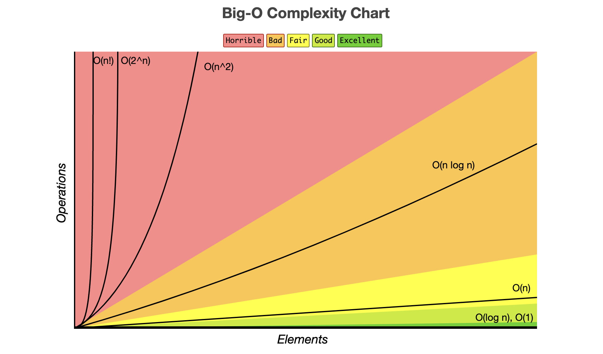
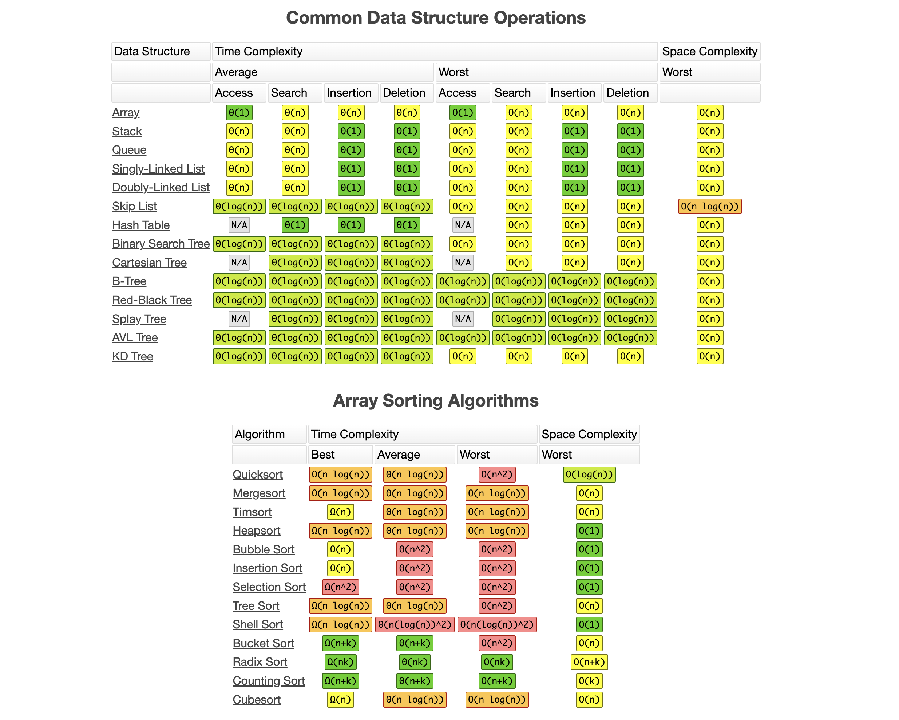
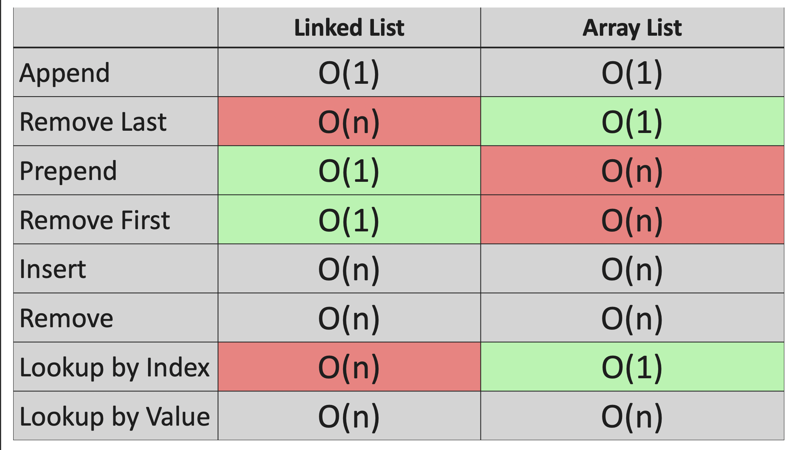

# Data Structure

## Big O Basic Concepts:

### O(1): Constant Time

- Doesn't depend on the size of the data set.
- Example: Accessing an array element by its index.

### O(log n): Logarithmic Time

- Splits the data in each step (divide and conquer).
- Example: Binary search.

### O(n): Linear Time

- Directly proportional to the data set size.
- Example: Looping through an array.

### O(n log n): Linearithmic Time

- Splits and sorts or searches data.
- Example: Merge sort, quick sort.

### O(n2): Polynomial Time

- Nested loops for each power of n.
- Example: Bubble sort (O(n2)).

### Omega (Ω) – Best Case

- <b>What it means:</b> Omega (Ω) describes the best-case scenario for an algorithm.
- <b>In simple terms:</b> It tells you the fastest an algorithm can run in the best circumstances.

### Theta (Θ) - Average Case

- <b>In simple terms:</b> It tells you what to generally expect in terms of time complexity.

### Big O (O) - Worst Case

<b>What it means:</b> Big O (O) describes the worst-case scenario for an algorithm.
<b>In simple terms:</b> It tells you the slowest an algorithm can run in the worst circumstances.

<!--  -->

<!--  -->

### Useful Tips

#### Drop Non-Dominant Terms

- In O(n2 + n), focus on O(n2) as it will dominate for large n.

#### Drop Constants

- O(2n) simplifies to O(n)

## Linked Lists

### Key Differences Between ArrayLists and LinkedLists

1. **Internal Data Structure**: ArrayLists internally use a dynamic array to store elements. LinkedLists, on the other hand, use a doubly linked list.

2. **Memory Allocation**: Elements in an ArrayList are stored in contiguous memory locations. In contrast, elements in a LinkedList are not stored in contiguous locations.

3. **Performance**: Manipulation (addition/removal of elements) is slower with ArrayLists because it involves shifting of elements. LinkedLists perform these operations faster as they only need to update the next and previous references.

4. **Access**: ArrayLists provide faster access to elements as they maintain an index to each element. LinkedLists require linear traversal to access elements.

5. **Usage**: ArrayLists are better for storing and accessing data. LinkedLists are more suitable for manipulating data.

6. **Interfaces**: ArrayLists implement only the List interface. LinkedLists implement both the List and Deque interfaces, allowing them to act as both a list and a queue.

<!--  -->

Diagram Showing the complexity of various operations

**Notes:-** Append - Adding Node in last, Prepend- Adding Node in beginning.
