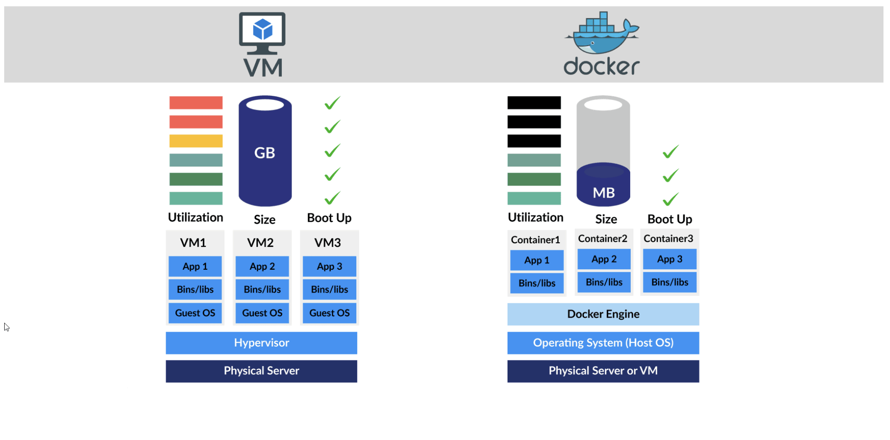

# DOCKER

## What is Docker?

Docker is a containerization platform that allows developers to easily build, deploy, and manage applications in containerized environments. Containers are lightweight, portable, and self-contained packages that include all the necessary dependencies and libraries needed to run a specific application.

Docker images can be created using writing script in docker file. While container is an instance of of images. Container can be created any number of times while image is being created at only once.

### Docker Vs Virtual Machine




### Docker Commands

1. docker run - > This command is used to run a container using image.
2. docker ps -> this command list all running container.
3. docker ps -a -> This command will give all running container as well as previously stopped container.
4. docker stop name/id -> This command is used to stop the running container
5. docker rm name_of_container -> This will remove the container permanently
6. docker images -> This will give all the docker images present with their sizes
7. docker rmi image_name/id -> This will remove the given image and to do so make sure, their should be any container of that image running.
8. docker pull image -> This command will only download the given image. It will not run the given image.
9. docker exec command -> Docker provides the docker exec command to run programs in containers that are already running.
10. docker run -d -> This will run the docker container in background and will give access to prompt instantly.
11. docker attach container name / container id -> It will run the background running application on terminal and we will be able to see it’s output.

#### Run tag

12. docker run redis:4.0 -> It say to run a container using redis 4.0 here redis:4.0 is a tag

By default docker container doesn’t listen to standard input. So to run docker container in interactive mode we use -i flag.

13.

```bash
docker run -i images_name
```

docker run -i image_name command will accept input but it will not provide terminal, to attach terminal we use docker run -it image_name

#### Port mapping on container

14.

```bash
docker run -p 80:5000 image_name
```

Here using -p flag we are mapping port 80 to the port 5000 inside the docker container.

By doing so we can run multiple instance of given service. ex- docker run -p 3306:3306 mysql, docker run -p 8301:3306 mysql

Here at port 3306 and 8301 of our system refers to mysql i.e is running on port 3306 inside docker container.

#### Volume mapping

- Remember, the docker container has its own isolated file system and any changes to any files happen within the container.
- Whenever we delete any container then the data inside container also gets deleted. If we want to persist data then we map the container with directory outside the container on docker host.

15.

```bash
docker run -v /opt/datadir:/var/lib/mysql mysql
```

16. docker inspect container_id -> used to get more details about given container in json format.
17. docker logs container_id -> This command is use to get logs of background running container.

#### Advanced Docker Run Features

- docker run ubuntu cat /etc/release -> It will download ubuntu and check its version (\* before and after release)
- docker run ubuntu sleep 15 -> It will run container of ubuntu and put them in sleep mode for 15 sec
- docker run timer -> It will print the current time including date/month/year and will keep changing on terminal every second.

### Jenkins -> It’s a web server

18. docker run jenkins/jenkins -> Use to run container of jenkins

To access this web server we can either use internal container IP address or we can use port mapping

jenkins container store it’s data inside /var/jenkins_home folder inside the given container.

### Docker Images

To create an instance of an image based on our name use <b> docker run --name name_of_choice image_name</b>

#### How to create new docker image?

So to create our own images, we follow few steps.

1. Create a Dockerfile: A Dockerfile is a script that contains instructions on how to build a Docker image. It specifies the base image to use, the files to include, and the commands to run when building the image.

2. Build the Docker image: Once you have created your Dockerfile, you can use the <b> docker build</b> command to build your Docker image. This command will read your Dockerfile and create a new image based on its instructions.

3. Tag the Docker image: After building your Docker image, you can tag it with a name and version number using the <b>docker tag</b> command. This will make it easier to reference your image later.

4. Push the Docker image to a registry: Finally, you can push your Docker image to a registry like Docker Hub using the docker push command. This will make it available for others to use and download.
   example

### Step 1: Create a Dockerfile

FROM python:3.7-alpine
COPY . /app
WORKDIR /app
RUN pip install -r requirements.txt

### Step 2: Build the Docker image

docker build -t my-image .

### Step 3: Tag the Docker image

docker tag my-image my-username/my-image:1.0

### Step 4: Push the Docker image to a registry

<b>docker push my-username/my-image:1.0</b>

To see the specific OS used by given images docker run python:3.6 cat /etc/_release_

To reduce the size of any image, make sure to use dependent images of lower size.

### Docker Environment Variables

<b>docker run -e APP_COLOR=blue image name</b> -> Here using flag -e, I set environment variable APP_COLOR to blue.
If a container is already running then to check the environment variable, first we will inspect the container using docker inspect container_name and then will look for environment variable under “Config”.

### CMD vs ENTRYPOINT

CMD and ENTRYPOINT are two instructions in a Dockerfile that define the process running in the containerCMD is used to describe the default container parameters or commands, while ENTRYPOINT specifies a command that will always be executed when the container starts

### Docker Compose

Docker Compose is a tool that helps you manage multiple Docker containers in a centralized way. It allows you to define your app’s environment with a Dockerfile so that it can be reproduced anywhere. You then define the services that make up your app in a <b>docker-compose.yml</b> file so that they can be run together in an isolated environment. Finally, you run <b>docker-compose up</b> and the Docker Compose command starts and runs your entire app

To link two or more image’s container together we use --link

Docker compose is by-default not installed with docker so we will separately download it.

The --link flag in Docker is used to link two containers together. When you link two containers, one container can access the other container’s network resources. This is useful when you have an application that requires a database or other service to function.

For example, let’s say you have a web application that requires a MySQL database. You can use the --link flag to link the web application container to the MySQL container. This will allow the web application to access the MySQL database using the hostname of the MySQL container. Here’s an example command that links a web application container to a MySQL container: docker run --name myapp --link mysql:mysql myapp In this example, myapp is the name of the web application container, and mysql is the name of the MySQL container. The --link flag specifies that the web application container should be linked to the MySQL container, and mysql:mysql specifies that the hostname of the MySQL container should be mysql.

Docker compose file example

```yml
# Indicates the version of docker-compose.yml file
version: '3'

# All service should be inside services
services:
  # Keyword before starting the service definition here redis,db,vote,worker and result is keyword name

  redis:
    image: redis
    networks:
      - back-end

  db:
    image: postgres:9.4
    environment:
      POSTGRES_USER: postgres
      POSTGRES_PASSWORD: postgres
    networks:
      - back-end

  vote:
    image: voting-app
    ports:
      - 5000:80
    links:
      - redis
    networks:
      - front-end
      - back-end

  worker:
    image: worker-app
    links:
      - db
      - redis
    networks:
      - back-end

  result:
    image: result-app
    ports:
      - 5001:80
    links:
      - db
    networks:
      - front-end
      - back-end

  networks:
    front-end:
      driver: bridge
    back-end:
      driver: bridge
```

- In docker compose version 2 and above, we do not require links to be specified, because it's already pre-linked with the container created by this docker-compose.yml file.

The container which will created by using the above docker-compose.yml file will have folder where this docker-compose.yml file is as prefix in their name and keyword as suffix.

ex - dockercomposeexample-worker-1 (dockercomposeexample is folder & worker service keyword)

### Dockerfile and docker-compose.yml are both used in Docker, but they serve different purposes:

#### Dockerfile:

A Dockerfile is a script that is used to build Docker images and name of docker file is case sensitive that is "Dockerfile" without any extension. It contains instructions to build an image, such as which base image to use, which packages and dependencies to install, and how to configure the container when it is run. A Dockerfile is used to define a single container and its environment. It is typically used for simple applications or for building a single component of a larger application.

```bash
docker build -t <image-name> <pathToDockerfile>
```

ex - <b>docker build -t vote ./</b>

docker-compose.yml:

A docker-compose.yml file is used to define and run multiple containers as a single service.
It is a declarative file that defines the relationships between containers, the networks they should be connected to, and the configurations that they should use.

It allows you to define the architecture of your application and the different services that make up your application, along with their dependencies and requirements.

It simplifies the process of running and managing multi-container applications.

In summary, a Dockerfile is used to build a single container image while a docker-compose.yml is used to define and run multiple containers as a cohesive application/service.

### Docker Registry

It’s a cloud where we keep all our docker images

—> Steps required to push our own images to Docker registry

1. Create Your Docker Image: This is like cooking your favorite dish where the recipe is your Dockerfile and the dish is your Docker image. Use the command <b> docker build -t your-image-name</b> . to cook up your Docker image.

2. Tag Your Docker Image: Now that you’ve cooked your dish, you need to label it properly before you can store it in the fridge (your Docker registry). Use the command <b>docker tag your-image-name localhost:5000/your-image-name </b> to label your Docker image with the address of your fridge.

3. Store Your Docker Image: With your dish properly labeled, you can now store it in the fridge so that it’s ready to be served whenever you want. Use the command docker push localhost:5000/your-image-name to store your Docker image in your Docker registry.

Remember, you need to have Docker installed and running on your machine to perform these steps. Also, depending on your Docker setup, you might need to add sudo at the beginning of these commands.

—> The <b> docker system prune -a </b> command is used to remove all unused Docker objects from your system. This includes:

Stopped containers: These are containers that are not currently running.

Dangling images: These are images not associated with a container.

Unused networks: These are networks that are not being used by any container.

All build cache: This is the cache that Docker builds up over time as you use it to create images.

The -a flag tells Docker to remove all unused objects, not just the dangling ones.

Please be careful when using this command, as it will permanently delete these objects and free up disk space. Always make sure you won’t need these objects in the future before running this command.

### Docker Engine, Storages and Networking

Docker Engine refers to the host where docker is installed.

docker run --cpus=.5 ubuntu -> Insures that the container can’t take more than 50% cpu of host.

docker run --memory=100m ubuntu

<b> docker volume create volume_name</b> -> To create the volume , <b> docker run -v volume_name:/var/lib/mysql mysql </b> -> It will mount mysql container volume to the volume which I created.

When we install docker in our system. It automatically creates /var/lib/docker folder and store all its data there.

### Networking

When we install docker it automatically creates 3 networks bridge, none & host.

Bridge network is automatically attached to container we creates. To specify other network we use this command <b>docker run ubuntu --network=none/host </b>

docker network ls -> To give number of network available on the host.

docker network inspect bridge-> to check subnet configured on bridge network

Q. Create a new network named wp-mysql-network using the bridge driver. Allocate subnet 182.18.0.1/24. Configure Gateway 182.18.0.1

Ans-

```bash
docker network create --driver bridge --subnet 182.18.0.1/24 --gateway 182.18.0.1 wp-mysql-network
```

### Container Orchestration, Docker Swarm & Kubernetes

Orhestration- Container orchestration is the automated process of managing or scheduling the work of individual containers for applications based on microservices within multiple clusters. It’s used to control and automate tasks such as deployment, scaling, networking, and availability of containers.

### Docker Swarm and Kubernetes

Docker Swarm: Think of it as a team of workers (Docker containers). Docker Swarm is the boss who manages this team. It ensures that there are enough workers (scaling), replaces any that are not working (resiliency), and ensures they can talk to each other (networking).

Kubernetes: This is like a bigger boss for a larger team. It does everything Docker Swarm does but in a more complex environment with more features. It can manage deployments, maintain volumes, and control different namespaces.
Both are used to manage containers, but Kubernetes offers more advanced features while Docker Swarm is easier to use.
