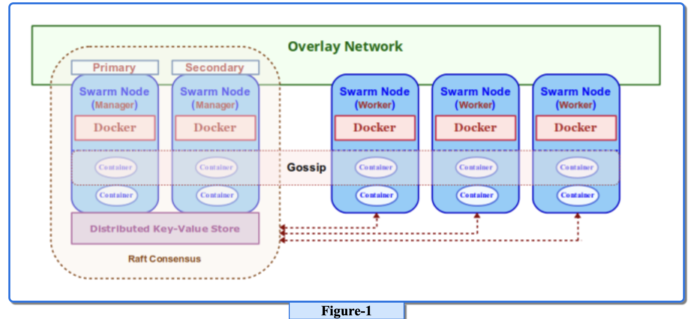
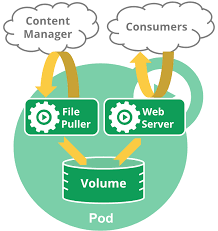

# Docker SWARM

Docker Swarm is a native clustering and orchestration solution from Docker that enables to bring together a bunch of machines (either physical or virtual) running Docker, to form a cluster such that the group of nodes appear to work together as a single virtual system. Once the cluster is formed, one can issue command to start a container and Docker Swarm will seemlessly orchestrate the request and schedule the container to run on any of the underlying node(s). As a result, this capability enables one scale, load balance, discovery, and provide high-availability for container services.

Note that we will be using the terms host(s), machine(s), and node(s) interchangeably. It is the entity running the Docker daemon.

The foundational element that enables this native cluster management in Docker Swarm is the overlay network. The overlay network driver is layered on top of the host network (also referred to as the underlay network) and creates a distributed network amongst the group of nodes running Docker.

In Introduction to Docker , we used the <span>docker run </span> commands to start a container application on a single node running Docker. This concept is abstracted to a higher level for Docker Swarm and is replaced by the docker service commands since we want multiple instances (replicas) of the container in the cluster. An instance of container running in Docker Swarm is referred to as a Task. It is the atomic scheduling unit for the cluster. A collection of task(s) forms a Service. A service can either be of type Replicated or Global.

For Replicated service(s), Docker Swarm schedules and distributes a specified number of task(s) (replicas) on the nodes of the cluster.

For Global service(s), Docker Swarm schedules one instance of a task on each node in the cluster.

The following Figure-1 illustrates the high-level architectural overview of a Docker Swarm:



The core components that make Docker Swarm are as follows:

1. Swarm Node :: a node (running Docker) participating in the Docker Swarm cluster. There are two types of nodes - Manager node(s) and Worker node(s)

2. Swarm Manager :: node responsible for the management of the cluster as well as the orchestration and scheduling of service(s) on the nodes in the cluster. When a service is deployed to the cluster, the request is dispatched through this node

3. Raft Consensus :: there can be more than one instance of the Manager running in the cluster for fault-tolerance and high-availability. When there are multiple instances of Manager nodes, they use the Raft Consensus Algorithm to elect a leader (Primary Manager node) and the rest become the followers (Secondary Manager node(s))

4. Distributed Key-Value Store :: For consistency, the leader Manager node is responsible for maintaining the state of the cluster as well as the state of the service(s) and their running task(s). This state information is persisted in the internal distributed key-value store and shared with the follower Manager node(s). This distributed key-value store is also used for service discovery

5. Swarm Worker :: node that receives requests from the Manager node(s) to execute task(s) (i.e., run container(s)). By default, the Manager node(s) are also Worker node(s). The Worker node(s) periodically report back the status of the currently running task(s) as well as heartbeats (to indicate the health of the Worker node) back to the Primary Manager node

6. Gossip :: as service(s) are deployed across the Worker node(s) in the cluster, the Worker node(s) gossip (broadcast information) about the running service(s) with the other Worker node(s) in the cluster so each of the Worker node(s) are aware of where a particular service is running. This way when a service request comes to a node, the request can be intelligently routed to the appropriate node(s) even if that service is not running on the node receiving the request

Docker Swarm is a cluster of Docker hosts

### Quorum

In Docker Swarm, active manager quorum refers to the minimum number of manager nodes required to be available and reachable in order to maintain the consistency of the Swarm cluster. This is necessary to ensure that important Swarm operations like the creation and deletion of services, changes in the Swarm configuration, and election of a new leader in case of leader failure can be performed.

The formula to calculate the active manager quorum is (n/2)+1 ,where n is the total number of manager nodes in the Swarm.

This means that for a Swarm with three manager nodes, at least two of them must be active and reachable for the quorum to be maintained. Similarly, for a Swarm with five manager nodes, at least three of them must be active and reachable.

Failure to maintain the active manager quorum can lead to inconsistencies and errors in the Swarm cluster. Therefore, it is important to always ensure that the quorum is maintained by having enough active manager nodes and by being prepared for manager node failures and recoveries.

To verify the active manager quorum of a Swarm cluster, you can use the following command:

```bash
docker info | grep -e 'Strategy:' -e 'Filters:' -e 'Nodes:'
```

The output of this command shows information about the Swarm cluster, including the active manager quorum, the Swarm strategy, and the number of nodes in the Swarm.

Docker ensures all manager nodes are in sync at all times by implementing RAFT Consensus

### Here's few command that is used in Docker SWARM

1. Initialize a Swarm/ To create Swarm Cluster:

```bash
docker swarm init
```

2. Join a node to the Swarm:

```bash
docker swarm join --token <TOKEN> <IP_ADDRESS>
```

3. To leave docker Swarm

```bash
docker swarm leave
```

4. This command lists all the nodes in the Swarm, including the manager and worker nodes. Running this command on any node in the Swarm will show all the nodes in the Swarm.

```bash
docker node ls
```

5. To join a node as Manager in the Swarm

```bash
docker swarm join --token <MANAGER_TOKEN> <MANAGER_IP_ADDRESS>:<MANAGER_PORT>
```

6. This command will give MANAGER_TOKEN, MANAGER_IP_ADDRESS & MANAGER_PORT

```bash
docker swarm join-token manager
```

7. This command will give WORKER_TOKEN, WORKER_IP_ADDRESS & WORKER_PORT

```bash
docker swarm join-token worker
```

8. To promote a node as MANAGER NODE , we will run this command from any MANAGER NODE

```bash
docker node promote node_name
```

9. Run this command inside the node which you want to shutdown

```bash
shutdown now
```

10. docker service ls command is used to list all the services running in a Docker Swarm mode cluster. This command lists the running services along with their ID, name, number of replicas, and the image used to create the service. It also displays the status of the service, whether it is running, paused, or has failed.

```bash
docker service ls
```

## Docker Service

It is little bit similar to docker run image_name command except --replicas

```bash
docker service create --name my-web-service --replicas 3 --publish 80:80 nginx
```

### Different Scenario with docker service create command.

This command will always run inside manager node.

Suppose we have 3 worker node and we give --replicas 4 then in that case one worker node will have 2 container and rest 2 worker node will have 1-1 container.

Suppose we have 4 worker node and we give --replicas 3 then in that case one worker node will be empty and other will have 1-1 container. Suppose at later time if one of worker node fails then in that case the scheduler will automatically run the container on left worker node.

### Replicas Vs Global

We use global, where we want to run one instance of my service in each node present inside the cluster example may be antivirus or monitoring services.

Here is the command to do so

```bash
docker service create --mode global service_name
```

The above command will run 1-1 instance of the given services in each nodes present inside the cluster.

To update the service we will use this command

```bash
docker service update --replicas 4 service_name
```

This command will update the given service with --replicas value 4

### Advanced Networking

<b>Overlay networks</b> are required when containers on different Docker hosts need to communicate directly with each other. These networks let you set up your own distributed environments for high availability.

<b>Ingress networking</b> in Docker Swarm is a network concept that enables external users to access services running inside a cluster. It provides an entry point for all incoming traffic and acts as a load balancer that distributes traffic to services running in different nodes within the cluster.

When you create a swarm cluster, an ingress network is automatically created. This network is used by the swarm to distribute incoming traffic among the published ports of the services running inside the cluster. To enable ingress networking for a service, you specify a published port while creating the service.

For example, the following command creates a web service named "my-web-service" that listens on port 80 and distributes incoming traffic to the same port:

```bash
docker service create --name my-web-service --publish 80:80 nginx
```

The

```bash
--publish
```

flag indicates the published port and the

```bash
nginx
```

image is used to provide web server functionality for the service.

When the service is created, it's automatically added to the ingress network, allowing external traffic from the internet to be load balanced to the service. The Swarm managers are responsible for ensuring that the traffic is forwarded to the appropriate service and the swarm workers handle the incoming requests.

Ingress networking provides a simple and powerful way of load balancing external traffic to services running inside a Docker Swarm cluster.

### Docker Stacks

Docker Compose is a tool for defining and running multi-container Docker applications. With Compose, you define your application’s services, networks, and volumes in a single YAML file, and then you can spin up the entire application stack with a single command. Compose is great for development environments, where you need to quickly build and test your applications and iterate on them.

Docker Stack, on the other hand, is a tool for deploying Docker Compose files to a Docker swarm. A swarm is a group of Docker hosts that act as a single virtual Docker host, and Docker Stack is used to manage the deployment of services across a swarm. With Docker Stack, you can deploy an entire Docker Compose application stack to a swarm, and then manage it as a single entity.

So, in summary, Docker Compose is used for defining and running multi-container Docker applications on a single host, while Docker Stack is used for deploying Docker Compose applications to a distributed swarm environment.

<b>docker-compose up</b> is used to start up a multi-container application defined in a <b>docker-compose.yml</b> file on a single Docker host. When you run this command, Docker Compose reads the file and , creates the necessary containers, and sets up the networks, volumes, and environment variables. It is useful for local development and testing.

On the other hand,

```bash
docker stack deploy
```

s used to deploy a multi-container application defined in a </b>docker-compose.yml</b> file to a Docker swarm. When you run this command, Docker reads the file and creates a stack, which is a collection of services that make up the application. The services are then deployed to the swarm, and Docker manages their replication and placement across the swarm nodes.

<b>docker stack deploy<b> is useful for production deployments, where you want to distribute your application across multiple nodes in a cluster and ensure high availability.

example of docker-compose.yml file

```yml
version: '3'
service:
  redis:
    image: redis
    networks:
      - back-end
    volumes:
      - redis-data:/var/lib/redis
    deploy:
      replicas: 1

  db:
    image: postgres:9.4
    networks:
      - back-end
    volumes:
      - db-data:/var/lib/postgresql/data
    deploy:
      replicas: 1
      placement:
        constraints: [node.role == manager]

  vote:
    image: voting-app
    ports:
      - '5000:80'
    networks:
      - back-end
      - front-end
    deploy:
      replicas: 2
      update_config:
        parallelism: 2

  result:
    image: result-app
    ports:
      - 5001:80
    networks:
      - back-end
      - front-end
    deploy:
      replicas: 1

  worker:
    image: worker-app
    networks:
      - back-end
    deploy:
      replicas: 1
      restart_policy:
        condition: on-failure
        delay: 10s
networks:
  front-end:
    driver: bridge
  back-end:
    driver: bridge

volumes:
  redis-data:
  db-data:
```

#### Docker Visualizer

Docker Visualizer is a simple web application that provides a visual representation of your Docker containers, images, and networks. It can help you to better understand how your Docker environment is set up, and to troubleshoot issues with your containers and network connections.

To start the Docker Visualizer, you can use the following

```bash
docker run
```

command:

```bash
docker run -it -d -p 8080:8080 -v /var/run/docker.sock:/var/run/docker.sock dockersamples/visualizer
```

This will download and run the Docker Visualizer image, and map the container port 8080 to the host port 8080. The
-v option is used to mount the Docker socket file from the host to the container, so that the Visualizer can access information about the Docker environment.

Once the Docker Visualizer is running, you can access it from a web browser at http://localhost:8080

(replace localhost with the IP address or hostname of your Docker host if you are running the Visualizer on a remote server).

In the visualizer UI, you should see a graph of all the containers and their connections in your Docker environment. You can click on a container to view its details, and zoom in and out of the graph to better see the connections between the containers.

### Docker Registry

<h3>How to create our own image and upload the same to our own registry server? </h3>

For doing so we will follow the below steps

Run this command to pull registry server image from docker hub

```bash
2
```

Pull any image from docker hub or create your own image. In my case I am pulling image from docker hub

```bash
docker pull ubuntu

# to upload the ubuntu image in our own local registry server first tag it with new name
docker tag ubuntu localhost:5000/ubuntu

# use this command to push the image in our own local registry server.
docker push localhost:5000/ubuntu
```

To stop registry and remove all data use this command

```bash
docker container stop registry && docker container rm -v registry
```

Docker registry frontend - The docker-registry-frontend is browser based solution for browsing and modifying a private docker registry.

```bash
docker run \
-d \
--name registry-frontend \
-e ENV_DOCKER_REGISTRY_HOST=registry \
-e ENV_DOCKER_REGISTRY_PORT=5000 \
-p 8080:80 \
--link registry:registry \
konradkleine/docker-registry-frontend:v2
```

For practice docker we can use this site https://labs.play-with-docker.com

### Docker Cloud

It's docker own cloud based container hosting platform.

#### Kubernetes

Kubernetes and Docker Swarm are both container orchestration tools that make it easier to manage containerized applications. However, they differ in several key ways:

Architecture: Kubernetes is built using a master-slave architecture, while Docker Swarm uses a leader-follower model. Kubernetes has a single master node that controls multiple worker nodes, while Docker Swarm has a leader node that manages one or more worker nodes.

Scalability: Kubernetes is designed to be highly scalable, and can easily manage thousands of containers simultaneously. Docker Swarm is also scalable, but has some limitations when it comes to managing large numbers of containers.

Flexibility: Kubernetes offers more flexibility in terms of customization and configuration management. It allows users to define their own APIs, and provides robust support for deploying, scaling, and managing services. Docker Swarm, on the other hand, is more opinionated and offers less customization.

Networking: Kubernetes has a more advanced networking model that supports multiple network interfaces, allowing users to create more complex network topologies. Docker Swarm, on the other hand, has a more simplistic networking model that is easier to manage.

##### Working of Docker Swarm & Kubernetes

Running a container in Docker Swarm and Kubernetes follows a similar process in general, but with some differences in terminology and usage. Here's the general process in both cases:

<b>Running a Container in Docker Swarm:</b>

- Create a Docker image of your application and publish it to a registry accessible to your Swarm cluster.
- Initialize Docker Swarm by creating a swarm manager node and adding worker nodes to the swarm.
- Create a Docker service that specifies the image to run, the desired number of replicas, and other configurations such as network and port mapping.
- Docker Swarm will distribute the service replicas across the worker nodes based on the defined scheduling strategy.

Monitor and manage the service using Docker Swarm commands such as

```bash
docker service ls
docker service ps
docker service scale
```

<b>Running a Container in Kubernetes:</b>

- Create a Docker image of your application and publish it to a registry accessible to your Kubernetes cluster.
- Create a Kubernetes cluster by deploying master and worker nodes and joining them.
- Create a Kubernetes deployment that specifies the container image, number of replicas, and other configurations such as resource limits, environment variables, and volume mounts.
- Kubernetes will schedule the deployment replicas onto the worker nodes based on the defined scheduling strategy.

Monitor and manage the deployment using Kubernetes commands such as

```bash
kubectl get deployments
kubectl describe deployment
kubectl scale deployment
```

In summary, both Docker Swarm and Kubernetes support running containers in a scalable and manageable way, with some differences in terminology and usage. Docker Swarm uses services for managing containers, while Kubernetes uses deployments, both of which allow easy scaling and monitoring of containerized applications.

Some of the useful commands used in Kubernetes are:

1. kubectl create: Used to create new resources such as pods, services, deployments, and config maps.

2. kubectl apply: Used to apply changes to existing resources.

3. kubectl get: Used to display information about resources.

4. kubectl describe: Used to display more detailed information about a specific resource.

5. kubectl logs: Used to view the logs of a container.

6. kubectl exec: Used to execute a command inside a container.

7. kubectl port-forward: Used to forward a port from a pod to the local machine.

8. kubectl delete: Used to delete a resource.

9. kubectl rollout: Used to manage rolling updates to deployments.

10. kubectl scale: Used to scale the number of replicas in a deployment.

<b>Pods in Kubernetes</b>

In Docker Swarm container was running directly inside the worker node but in Kubernetes it's run inside a pod.

In Kubernetes, a pod is the smallest deployable unit that represents a logical host for containers. Pods are used to group one or more containers that are deployed together on the same host, share the same IP address and network namespace, and have access to the same shared storage resources. Essentially, a pod is a single instance of an application, and all its containers run together on the same node.

Pods provide an abstraction layer on top of individual containers that makes it easier to manage complex applications. For example, if an application requires multiple containers to run together, such as a web server and a database, both containers can be grouped in a single pod to ensure that they are always scheduled together and run on the same host. Additionally, multiple instances of the same pod can be created to scale the application horizontally.

Some key features and work of pods in Kubernetes include:

Shared resources: All containers within a pod share the same network namespace and can communicate with each other using the same IP address and port space. They also have access to the same shared storage volumes, making it easier to share data between containers.

Robustness: Pods in Kubernetes are designed to be highly available and resilient. If a pod fails or becomes unavailable, Kubernetes can automatically create a new instance of the pod on a different node.

Life-cycle management: Pods can be easily created, managed, and deleted using Kubernetes commands, making it easier to deploy and update applications.

Load balancing: Kubernetes can distribute incoming traffic across multiple pods to ensure that the workload is evenly distributed and to provide high availability.

In summary, a pod in Kubernetes represents a logical host for one or more containers, and provides an abstraction layer that makes it easier to manage complex applications. Pods can be created, scaled, and managed in Kubernetes, and provide a flexible and resilient framework for running containerized applications.



Each pod will have their own separate storage. A pod can have multiple container inside it.

We can practice Kubernetes using Kubernetes play ground or On Google cloud platform.
