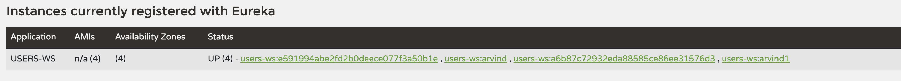
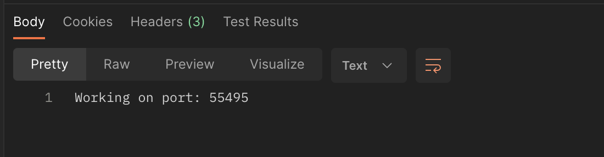
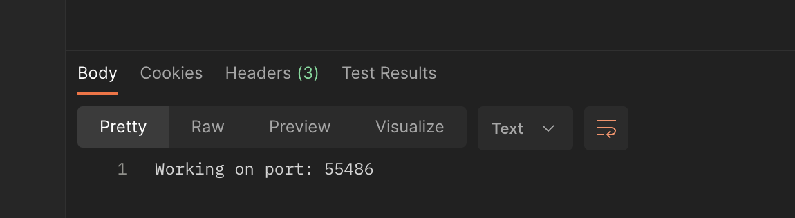

## Eureka Discovery Service

Eureka Discovery Service is a REST-based service used for locating services for the purpose of load balancing and failover of middle-tier servers. It’s part of Netflix’s spring cloud services. Services register themselves with Eureka and also use it to discover other services. Eureka then helps in distributing the network traffic evenly among available service instances. In case of failure, Eureka helps by rerouting requests to different available service instances. It’s an essential tool for microservices architecture where service discovery and failover are critical.

Below diagram show how Eureka work.


### Create and Configure Eureka Discovery Server

- For this we will follow these steps

1. Add Eureka Server dependency

```xml
<dependency>
	<groupId>org.springframework.cloud</groupId>
	<artifactId>spring-cloud-starter-netflix-eureka-server</artifactId>
</dependency>
```

2. Add @EnableEurekaServer annotation

```java
@SpringBootApplication
@EnableEurekaServer
public class PhotoAppDiscoveryServiceApplication {

	public static void main(String[] args) {
		SpringApplication.run(PhotoAppDiscoveryServiceApplication.class, args);
	}
}
```

3. Add these things in application.properties

```properties
server.port=8010
spring.application.name=discoveryservice
eureka.instance.hostname=localhost
eureka.client.register-with-eureka=false
eureka.client.service-url.defaultZone=http://${eureka.instance.hostname}:${server.port}/eureka
```

After doing so we will be able to see Eureka server dashboard by visiting url http://localhost:8010. Here is the Screenshot of Eureka server Dashboard.


Upto this point we have created Eureka Server. Now, we will create client of it's and enable eureka client. For doing so we will follow these steps.

1. Add this dependency for Eureka client.

```xml
<dependency>
	<groupId>org.springframework.cloud</groupId>
	<artifactId>spring-cloud-starter-netflix-eureka-client</artifactId>
</dependency>
```

2. Add @EnableDiscoveryClient annotation in our project.

```java
@SpringBootApplication
@EnableDiscoveryClient
public class PhotoAppApiUsersApplication {

	public static void main(String[] args) {
		SpringApplication.run(PhotoAppApiUsersApplication.class, args);
	}

}
```

3. Add this in application.properties

```properties
    # server.port=0 will assign random port to this application
    server.port=0
    spring.application.name=users-ws
    eureka.client.service-url.defaultZone=http://localhost:8010/eureka
    spring.devtools.restart.enabled=true
```

Now run the application but before run this make sure to run Eureka discovery server first.
After successful launch of application we wil see that users microservice will register itself automatically in eureka server and same can be seen by going to http://localhost:8010 url.

## Spring Cloud API Gateway

Spring Cloud Gateway is an open-source API Gateway framework built on top of the Spring Boot and Spring WebFlux frameworks. It provides a way to route, filter, and transform HTTP requests before they reach the backend services. Some of its key features include routing based on various criteria, support for a wide range of filters to modify the request or response, integration with various load balancing technologies, caching responses from backend services, and support for circuit breaking.

Netflix Eureka is a service registry that helps in managing microservices. When a microservice starts, it registers itself with Eureka. Other services then look up Eureka to find the locations of other services. This makes it easier to handle changes in service locations.

When used together, Spring Cloud Gateway can use Eureka to discover the locations of microservices. This allows the Gateway to route requests to the appropriate services without needing to know their locations in advance. This combination can help to scale Spring applications easily in production environments and load balance them effectively.


### Creating Api Gateway Project

To create Api Gateway Project follow the below steps

1. Add these dependency

```xml
 <dependency>
    <groupId>org.springframework.boot</groupId>
    <artifactId>spring-boot-starter-webflux</artifactId>
</dependency>

<dependency>
    <groupId>org.springframework.cloud</groupId>
    <artifactId>spring-cloud-starter-gateway</artifactId>
</dependency>

<dependency>
    <groupId>org.springframework.cloud</groupId>
    <artifactId>spring-cloud-starter-netflix-eureka-client</artifactId>
</dependency>
```

2. Add following code in application.properties

```properties
server.port=8082
spring.application.name=api-gateway
eureka.client.service-url.defaultZone=http://localhost:8010/eureka
```

### Automatic Mapping of API Gateway routes

For doing so add this in application.properties

```properties
spring.cloud.gateway.discovery.locator.enabled=true
```

Now when we will use http://localhost:8082/USERS-WS/users/status/check url. It will automatically hit /users/status/check which is inside USERS-WS microservices. Here USERS-WS will be in capital letters else we will get error. If you wish to use small letter add this inside application.properties.

```properties
spring.cloud.gateway.discovery.locator.lower-case-service-id=true
```

if we have more microservices to start up and register with Eureka, we should be able to send the Http request to them via API gateway using their service name in the URL of Http request. But this is not always the case.

Often we do not want to use the application name in the request URL and we need our request URL to look slightly different. To do that, we can create custom gateway routes manually and we can have more granular control of the request mapping.

### Manually Configuring API Gateway routes

For doing so add this in application.properties

```properties
spring.cloud.gateway.routes[0].id=users-status-check
#Here lb represent to load balancer and users-ws is name of microservices.
spring.cloud.gateway.routes[0].uri=lb://users-ws
spring.cloud.gateway.routes[0].predicates[0]=Path=/users/status/check

#spring.cloud.gateway.routes[0].predicates[1]=Method=GET,POST,PUT,DELETE - In case of multiple method
spring.cloud.gateway.routes[0].predicates[1]=Method=GET

# it will remove RemoveRequestHeader=Cookie from headers.
spring.cloud.gateway.routes[0].filters[0]=RemoveRequestHeader=Cookie
```

Now when request will come from this url http://localhost:8082/users/status/check. It will check whether the method is GET or not. If request is GET then in that case it will automatically forward that request to users-ws microservice. Thus, we will able to access users/status/check from users-ws microservice.

### Rewriting URL Path

For doing so we will make few changes in our application.properties

```properties
spring.cloud.gateway.routes[0].predicates[0]=Path=/users-ws/users/status/check

# Here RewritePath=externalPath,internalPath
#spring.cloud.gateway.routes[0].filters[1]=RewritePath=/users-ws/users/status/check, /users/status/check

# Here we can write RewritePath=/users-ws/users/status/check, /users/status/check as regular expression
spring.cloud.gateway.routes[0].filters[1]=RewritePath=/users-ws/(?<segment>.*),/$\{segment}
```

Now when we will send request at http://localhost:8082/users-ws/users/status/check. It will then automatically rewrite the url as /users/status/check instead of /users-ws/users/status/check
We can combine both Automatic and manual routing together.

### Automatic and Manual Routing

```properties
spring.cloud.gateway.routes[0].id=users-status-check
spring.cloud.gateway.routes[0].uri=lb://users-ws
spring.cloud.gateway.routes[0].predicates[0]=Path=/users/status/check
spring.cloud.gateway.routes[0].predicates[1]=Method=GET
spring.cloud.gateway.routes[0].filters[0]=RemoveRequestHeader=Cookie

#spring.cloud.gateway.routes[0].filters[1]=RewritePath=/users-ws/(?<segment>.*),/$\{segment}

spring.cloud.gateway.discovery.locator.enabled=true
spring.cloud.gateway.discovery.locator.lower-case-service-id=true
```

Now if we send request to http://localhost:8082/users-ws/users/status/check or http://localhost:8082/users/status/check both will go and check controller method for mapping /users/status/check from microservice name users-ws.

### Build-In Predicate Factories

Built-in Route Predicate Factories in Spring Cloud API Gateway
Below is a list of built-in predicates that you can use when creating routes in Spring Cloud API Gateways. These are built-in predicates and you do not need to write any additional Java code for them to work.

Note: The description of the following built-in predicates is taken from the Spring Cloud API Gateway documentation page.

#### 1. The After Route Predicate Factory

The After route predicate factory takes one parameter, a datetime (which is a java ZonedDateTime). This predicate matches requests that happen after the specified datetime. The following example configures an after route predicate:

```properties
spring.cloud.gateway.routes[0].id = after_route
spring.cloud.gateway.routes[0].uri = https://example.org
spring.cloud.gateway.routes[0].predicates[0] = After=2017-01-20T17:42:47.789-07:00[America/Denver]
```

This route matches any request made after Jan 20, 2017 17:42 Mountain Time (Denver).

#### 2. The Before Route Predicate Factory

The Before route predicate factory takes one parameter, a datetime (which is a java ZonedDateTime). This predicate matches requests that happen before the specified datetime. The following example configures a before route predicate:

```properties
spring.cloud.gateway.routes[0].id = before_route
spring.cloud.gateway.routes[0].uri = https://example.org
spring.cloud.gateway.routes[0].predicates[0] = Before=2017-01-20T17:42:47.789-07:00[America/Denver]
```

This route matches any request made before Jan 20, 2017 17:42 Mountain Time (Denver).

#### 3. The Between Route Predicate Factory

The Between route predicate factory takes two parameters, datetime1 and datetime2 which are java ZonedDateTimeobjects. This predicate matches requests that happen after datetime1 and before datetime2. The datetime2 parameter must be after datetime1. The following example configures a between route predicate:

```properties
spring.cloud.gateway.routes[0].id = between_route
spring.cloud.gateway.routes[0].uri = https://example.org
spring.cloud.gateway.routes[0].predicates[0] = Between=2017-01-20T17:42:47.789-07:00[America/Denver], 2017-01-21T17:42:47.789-07:00[America/Denver]
```

This route matches any request made after Jan 20, 2017 17:42 Mountain Time (Denver) and before Jan 21, 2017 17:42 Mountain Time (Denver). This could be useful for maintenance windows.

#### 4. The Cookie Route Predicate Factory

The Cookie route predicate factory takes two parameters, the cookie name and a regexp (which is a Java regular expression). This predicate matches cookies that have the given name and whose values match the regular expression. The following example configures a cookie route predicate factory:

```properties
spring.cloud.gateway.routes[0].id = cookie_route
spring.cloud.gateway.routes[0].uri = https://example.org
spring.cloud.gateway.routes[0].predicates[0] = Cookie=chocolate, ch.p
```

This route matches requests that have a cookie named chocolate whose value matches the ch.p regular expression.

#### 5. The Header Route Predicate Factory

The Header route predicate factory takes two parameters, the header name and a regexp (which is a Java regular expression). This predicate matches with a header that has the given name whose value matches the regular expression. The following example configures a header route predicate:

```properties
spring.cloud.gateway.routes[0].id = header_route
spring.cloud.gateway.routes[0].uri = https://example.org
spring.cloud.gateway.routes[0].predicates[0] = Header=X-Request-Id, \d+
```

This route matches if the request has a header named X-Request-Id whose value matches the \d+ regular expression (that is, it has a value of one or more digits).

#### 6. The Host Route Predicate Factory

The Host route predicate factory takes one parameter: a list of host name patterns. The pattern is an Ant-style pattern with . as the separator. This predicates matches the Host header that matches the pattern. The following example configures a host route predicate:

```properties
spring.cloud.gateway.routes[0].id = host_route
spring.cloud.gateway.routes[0].uri = https://example.org
spring.cloud.gateway.routes[0].predicates[0] = Host=**.somehost.org,**.anotherhost.org
```

URI template variables (such as {sub}.myhost.org) are supported as well.

This route matches if the request has a Host header with a value of www.somehost.org or beta.somehost.org or www.anotherhost.org.

This predicate extracts the URI template variables (such as sub, defined in the preceding example) as a map of names and values and places it in the ServerWebExchange.getAttributes() with a key defined in ServerWebExchangeUtils.URI_TEMPLATE_VARIABLES_ATTRIBUTE. Those values are then available for use by GatewayFilterfactories

#### 7. The Method Route Predicate Factory

The Method Route Predicate Factory takes a methods argument which is one or more parameters: the HTTP methods to match. The following example configures a method route predicate:

```properties
spring.cloud.gateway.routes[0].id = method_route
spring.cloud.gateway.routes[0].uri = https://example.org
spring.cloud.gateway.routes[0].predicates[0] = Method=GET,POST
```

This route matches if the request method was a GET or a POST.

#### 8. The Path Route Predicate Factory

The Path Route Predicate Factory takes two parameters: a list of Spring PathMatcher patterns and an optional flag called matchOptionalTrailingSeparator. The following example configures a path route predicate:

```properties
spring.cloud.gateway.routes[0].id = path_route
spring.cloud.gateway.routes[0].uri = https://example.org
spring.cloud.gateway.routes[0].predicates[0] = Path=/red/{segment},/blue/{segment}
```

This route matches if the request path was, for example: /red/1 or /red/blue or /blue/green.

This predicate extracts the URI template variables (such as segment, defined in the preceding example) as a map of names and values and places it in the ServerWebExchange.getAttributes() with a key defined in ServerWebExchangeUtils.URI_TEMPLATE_VARIABLES_ATTRIBUTE. Those values are then available for use by GatewayFilterfactories

#### 9. The Query Route Predicate Factory

The Query route predicate factory takes two parameters: a required param and an optional regexp (which is a Java regular expression). The following example configures a query route predicate:

```properties
spring.cloud.gateway.routes[0].id = query_route
spring.cloud.gateway.routes[0].uri = https://example.org
spring.cloud.gateway.routes[0].predicates[0] = Query=green
```

The preceding route matches if the request contained a green query parameter.

#### 10. The RemoteAddr Route Predicate Factory

The RemoteAddr route predicate factory takes a list (min size 1) of sources, which are CIDR-notation (IPv4 or IPv6) strings, such as 192.168.0.1/16 (where 192.168.0.1 is an IP address and 16 is a subnet mask). The following example configures a RemoteAddr route predicate:

```properties
spring.cloud.gateway.routes[0].id = remoteaddress_route
spring.cloud.gateway.routes[0].uri = https://example.org
spring.cloud.gateway.routes[0].predicates[0] = RemoteAddr=192.168.1.1/24
```

This route matches if the remote address of the request was, for example, 192.168.1.10.

#### 11. The Weight Route Predicate Factory

The Weight route predicate factory takes two arguments: group and weight (an int). The weights are calculated per group. The following example configures a weight route predicate:

```properties
spring.cloud.gateway.routes[0].id = weight_high
spring.cloud.gateway.routes[0].uri = https://example.org
spring.cloud.gateway.routes[0].predicates[0] = Weight=group1, 8

spring.cloud.gateway.routes[1].id = weight_low
spring.cloud.gateway.routes[1].uri = https://example.org
spring.cloud.gateway.routes[1].predicates[0] = Weight=group1, 2
```

This route would forward ~80% of traffic to weighthigh.org and ~20% of traffic to weighlow.org

### Gateway Filters

A list of API Gateway filters is very long to be included in a single lecture. Below are direct links to gateway filters published in Spring Cloud API Gateway documentation.

<ul>
<li><a href="https://cloud.spring.io/spring-cloud-gateway/reference/html/#gatewayfilter-factories">GatewayFilter Factories</a></li>
<li><a href="https://cloud.spring.io/spring-cloud-gateway/reference/html/#global-filters">Global Filters</a></li>
<li><a href="https://cloud.spring.io/spring-cloud-gateway/reference/html/#httpheadersfilters">HTTPHeadersFilters</a></li>
</ul>

You can bookmark these pages in your browser for quick access.

## Spring Cloud API Gateway as Load Balancer

### Starting Up more microservices

- If we start more instances of a microservices application then only the last instance will register itself with Eureka Discovery Service. In order to register all instances we will modify our application.properties.

```properties
# If we pass PORT value from command line then that or else application will run on random port.
server.port=${PORT:0}
spring.application.name=users-ws
eureka.client.service-url.defaultZone=http://localhost:8010/eureka
spring.devtools.restart.enabled=true

# Instance will be named based on this criteria. If you pass spring.application.instance_id value from the command line then it will add that things in name or else random value.
eureka.instance.instance-id=${spring.application.name}:${spring.application.instance_id:${random.value}}
```

- Here if we don not pass server.port or spring.application.instance_id value then default value will be assigned.
- Here is the diagram showing multiple instances of a microservices.



- We can use this command to run our microservices instance

```bash
mvn spring-boot:run -Dspring-boot.run.arguments="--spring.application.instance_id=arvind1 --server.port=8083"
```

### How Load Balancer Work

First request will come to API gateway then API Gateway will decide which instance of microservice to send the request. To check this we will change our UsersController's code. Here first I will read the environment variable using Environment object and then running Api Gateway application.

```java
@RestController
@RequestMapping("/users")
public class UsersController {
  @Autowired
  private Environment env;

  @GetMapping("/status/check")
  public String status(){
    return "Working on port: "+env.getProperty("local.server.port");
  }
}

```

Here is the screenshot which Shows API Gateway is working.

<div style="text-align:center">

</div>

## H2 In-memory Database

To use h2 database first add these 2 dependency.

```xml
<dependency>
	<groupId>org.springframework.boot</groupId>
	<artifactId>spring-boot-starter-jdbc</artifactId>
</dependency>

<dependency>
	<groupId>com.h2database</groupId>
	<artifactId>h2</artifactId>
	<scope>runtime</scope>
</dependency>
```

Now, add these things in application.properties.

```properties
# H2 in memory database settings
spring.h2.console.enabled=true
spring.datasource.url=jdbc:h2:mem:testdb
spring.datasource.driverClassName=org.h2.Driver
spring.jpa.database-platform=org.hibernate.dialect.H2Dialect

# Allow api gateway and other microservice to use h2 database of users-ws
spring.h2.console.settings.web-allow-others=true
```

# Users Microservice - Implementing user Sign Up

We know that If springboot receive JSON object it automatically convert that into java object, But for this we will have to create a class first. Here I am creating class name CreateUserRequestModel.

To add validation for this we will add this dependency.

```xml
<dependency>
	<groupId>org.springframework.boot</groupId>
	<artifactId>spring-boot-starter-validation</artifactId>
</dependency>
```

Now in CreateUserRequestModel Class we will add things like @NotNull, @Size(min="", max="", message="") etc

```java
public class CreateUserRequestModel {

 @NotNull(message = "Please provide first name")
 @Size(min =2, message = "First Name can't be less than 2 characters")
  private String firstName;

  @NotNull(message = "Please provide last name")
  @Size(min =2, message = "Last Name can't be less than 2 characters")
  private String lastName;

  @NotNull(message = "Please provide email")
  @Email
  private String email;

  @NotNull(message = "Password can not be blank")
  @Size(min = 8,max = 12,message = "Please provide password in the range of 8-12 characters")
  private String password;
}

```

Now After adding validation, we will have to add @Valid annotation just before @RequestBody then only our validation will work.

```java
 public String createUser(@Valid @RequestBody CreateUserRequestModel userDetails)
```

- The serialVersionUID is a unique ID for each version of a serializable class. It’s used during deserialization to ensure the sender and receiver of a serialized object have compatible classes. If the serialVersionUID doesn’t match, an InvalidClassException is thrown. It’s recommended to declare this ID explicitly to avoid unexpected exceptions.

To work with spring data jpa add this dependency

```xml
<dependency>
	<groupId>org.springframework.boot</groupId>
	<artifactId>spring-boot-starter-data-jpa</artifactId>
</dependency>
```

### ModelMapper

ModelMapper is an intelligent, refactoring safe object mapping library that automatically maps objects to each other. It’s used in Spring Boot for the conversion of entity objects to Data Transfer Objects (DTOs) and vice-versa.

To use ModelMapper use this dependency, here make sure to use dependency version also.

```xml
<dependency>
	<groupId>org.modelmapper</groupId>
	<artifactId>modelmapper</artifactId>
	<version>3.2.0</version>
</dependency>
```

### Add Spring Security to User Microservice.

I can't store raw password directly into our database so for this I will use Spring Security, which will encrypt the raw password.

For Spring Security I will use this dependency

```xml
<dependency>
	<groupId>org.springframework.boot</groupId>
	<artifactId>spring-boot-starter-security</artifactId>
</dependency>
```

After adding this dependency, It will protect all our urls automatically to get rid of this we will create this class

```java

@Configuration
@EnableWebSecurity
public class WebSecurity {

  @Bean
  protected SecurityFilterChain configure(HttpSecurity http) throws Exception{
    http.csrf().disable();
    http.authorizeHttpRequests()
            .requestMatchers(HttpMethod.POST,"/users")
            .permitAll()
            .requestMatchers(new AntPathRequestMatcher("/h2-console/**")).permitAll()
            .and()
            .sessionManagement().sessionCreationPolicy(SessionCreationPolicy.STATELESS);

    http.headers().frameOptions().disable();
    return http.build();
  }
}

```

### Allow request from API gateway only

Allow request to come from only certain IP address we will do the following changes.

1. Create "gateway.ip" property in application.properties and assign it ip address.

```properties
gateway.ip=ip_address_which_you_want_to_allow
```

2. Do this modification in WebSecurity class.

```java

@Configuration
@EnableWebSecurity
public class WebSecurity {

  @Autowired
  private Environment environment;

  @Bean
  protected SecurityFilterChain configure(HttpSecurity http) throws Exception{
    http.csrf().disable();

    // This code allow allow request only from certain ip address.
    http.authorizeHttpRequests()
            .requestMatchers(HttpMethod.POST,"/users")
            // .permitAll()
            .access(new WebExpressionAuthorizationManager("hasIpAddress('"+environment.getProperty("gateway.ip")+"')"))
            .requestMatchers(new AntPathRequestMatcher("/h2-console/**")).permitAll()
            .and()
            .sessionManagement().sessionCreationPolicy(SessionCreationPolicy.STATELESS);

    http.headers().frameOptions().disable();
    return http.build();
  }
}

```

By doing so spring security will allow request to only the given IP address.

### Adding support to return XML value

For getting XML value return back we will add these dependency

```xml
<dependency>
	<groupId>com.fasterxml.jackson.dataformat</groupId>
	<artifactId>jackson-dataformat-xml</artifactId>
</dependency>
```

Only adding these dependency and sending "Accept=application/xml" will give XML back in response. However we can further add these things in our controller class.

```
@PostMapping(produces = {MediaType.APPLICATION_JSON_VALUE,MediaType.APPLICATION_XML_VALUE})
```

This code simply says this post method can return both json and xml value back. Below code says it can pass both xml or json value with request also.

```
@PostMapping(produces = {MediaType.APPLICATION_JSON_VALUE,MediaType.APPLICATION_XML_VALUE}, consumes={MediaType.APPLICATION_JSON_VALUE,MediaType.APPLICATION_XML_VALUE})
```
